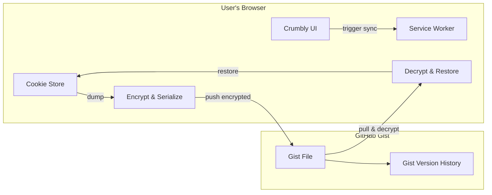
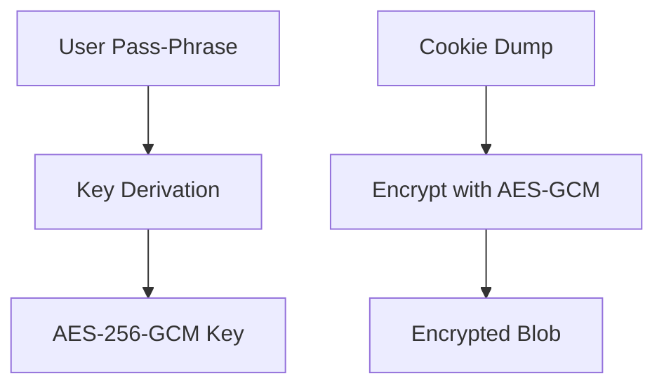
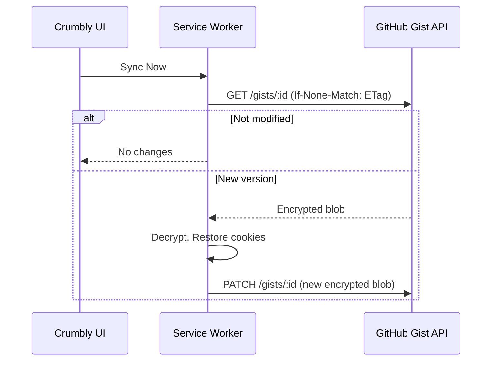
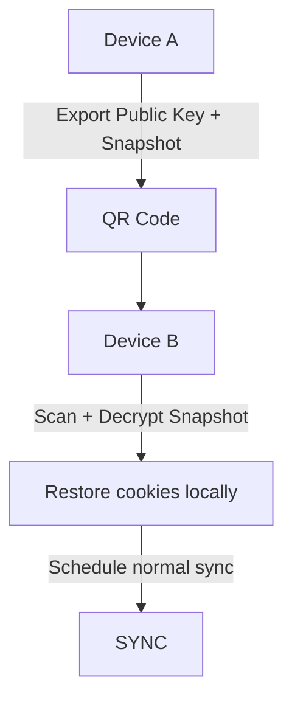

# 🍪 Crumbly – Secure, Magic Cookie Sync (Browser Extension)

> Sync your browser cookies across devices and browsers — securely, magically, and without a middleman.


<p align="center">
  
</p>

<h1 align="center">Crumbly</h1>
<p align="center"><em>Sync your cookies. Securely. Magically.</em></p>

---

Crumbly is a **browser-agnostic extension** that lets you seamlessly sync your cookies between Chrome, Firefox, Edge, and Safari using your own [GitHub Gist](https://gist.github.com). Your session data never touches third-party servers. It’s **encrypted, peerless, and works like magic.**

---

## ✨ Why Crumbly?

| 🔐 Privacy-first          | 🔄 Seamless Sync             | 🪄 Feels like Magic             |
|--------------------------|------------------------------|----------------------------------|
| End-to-end AES-GCM encryption | Auto-pushes and pulls session cookies | QR pairing, tab teleport, and context-aware profiles (coming soon) |
| Zero-knowledge, zero backend | Works across browsers & OSes | Makes cookie sync fun & effortless |
| Your GitHub, your data | Manual or scheduled sync | No login? No problem. Just scan a QR. |

---

## 🧠 How It Works

1. You authorize **Crumbly** to access your GitHub account via OAuth (or manually paste a PAT).
2. Crumbly creates (or uses) a **private Gist** in your account.
3. Your cookies are:
   - Dumped into structured JSON
   - Encrypted with **AES-256-GCM**
   - Pushed to your private Gist
4. On another device/browser, Crumbly:
   - Pulls the Gist
   - Decrypts it using your pass-phrase
   - Restores the cookies into your browser

All keys are derived **client-side**. We **never see anything**.  
You own the sync. Crumbly just makes it ✨frictionless.

### 1. High-level system flow


***Narative***: The browser collects cookies, encrypts them with WebCrypto, and pushes them to your GitHub Gist. On another browser, the same process runs in reverse — pull, decrypt, restore.

### 2. Encryption & Key Derivation Flow



***Narative***: Crumbly derives an AES key from your pass-phrase. Cookies are dumped, encrypted with that key using AES-GCM, and Base64-encoded before upload. The key is **never stored**.

### 3. GitHub Sync Mechanism (Gist Push/Pull)



***Narative***: The service worker pings GitHub with the last known ETag. If unchanged, it skips. If changed, it pulls and restores. On push, it uses PATCH with optimistic locking (If-Match).

#### 4. QR Handshake Pairing (Magic Feature)



***Narative***: Your main device generates a short-lived encrypted snapshot + public key, encodes it into a QR code. The new device scans it, decrypts it (with pass-phrase), and boots up fully synced.

---

## 🚀 Getting Started

1. **Install Crumbly** (coming soon to Chrome, Firefox, Edge, Safari)
2. **Authorize GitHub** or paste a token with `gist` scope
3. **Set a pass-phrase** to encrypt your session
4. Click “💾 Sync now” — or let Crumbly do it on a timer
5. Install on your other device, repeat, and your session *just works* 🪄

> Want to pair devices fast?  
> Crumbly supports **QR Handshake Pairing** — no GitHub login needed on the second device.

---

## 🛡️ Security at a Glance

| Layer        | How Crumbly handles it |
|--------------|------------------------|
| **Encryption** | AES-256-GCM via native WebCrypto |
| **Key derivation** | PBKDF2 (or Argon2, coming soon) from your pass-phrase |
| **At-rest storage** | Gist contains encrypted blob only. Zero plaintext. |
| **No backend** | Crumbly never transmits data to any Crumbly server. |
| **Your GitHub** | Only *your* token, *your* Gist, *your* rules. |

---

## 🪄 Planned “Magic” Features

| Feature | Description |
|--------|-------------|
| **QR Handshake Pairing** | Sync to a new device by scanning a QR — no GitHub login required |
| **Tab Teleport** | Move active tabs from one browser to another, cookies and all |
| **Context-Aware Profiles** | Automatically switch between cookie sets based on time, site, or device |
| **AI Tracker Cleaner** | Suggest safe-to-delete cookies with one click |

---

## 🧩 Tech Stack

- WebExtension API (Manifest V3)
- Vite + React + Tailwind
- WebCrypto API for AES-GCM
- GitHub Gist API (REST)
- Cross-browser with MV3 & polyfill

---

## 🛠️ For Developers

Clone and build:

```bash
pnpm install
pnpm dev         # for local preview
pnpm build       # build MV3 dist/ for browser
````

Load `dist/` as an unpacked extension:

* `chrome://extensions`
* `about:debugging`
* `edge://extensions`

Want to contribute? See [`CONTRIBUTING.md`](./CONTRIBUTING.md) and open a PR!

---
## ⚠️ Disclaimer & Security Notice

Crumbly is designed with **strong encryption and zero-trust architecture**, but **cookies are still sensitive data**. Please keep the following in mind:

### 🔒 Your passphrase is your only line of defense
- Your cookies are encrypted with a key derived from your passphrase using **AES-256-GCM** and **PBKDF2 / Argon2**.
- **We never store or transmit your passphrase or encryption key** — only you know it.
- ⚠️ **If someone gains access to your passphrase, they can decrypt your cookies** — treat it like a password to your browser session.

### 🌐 Session reuse may be blocked by some websites
- Not all websites allow session reuse across devices or browsers.  
  Crumbly **copies the cookie**, but some sites may:
  - Bind sessions to device fingerprints or IPs
  - Invalidate sessions when they detect reuse
  - Require re-authentication regardless of the cookie

### 🧪 Best effort, not bulletproof
- Crumbly **does not bypass security** — it simply syncs your own session data.
- It is not a tool for impersonation, scraping, or automated login to accounts you don't own.
- We recommend **logging out from all sessions** before switching GitHub tokens or sharing devices.

> TL;DR: **Treat your passphrase like a password.**  
> Crumbly helps you sync your session — it doesn’t guarantee sites will let that session work.
---

## 📄 License

MIT License — feel free to fork, extend, remix.
If you build something magical with Crumbly, we’d love to hear about it!

---

## 🧁 A crumb of delight

> “Crumbly syncs your cookies, not your soul.”
> — probably someone on Hacker News
